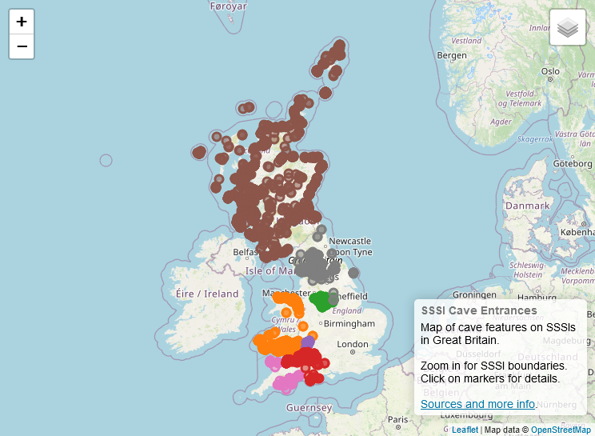

# SSSI Cave Entrances
This project illustrates how many of cave and mine entrances (and other karst features such as sinks, resurgences, and digs) can be found on Special Sites of Scientific Interest in Great Britain.

> **Note**: the results of this analysis are only as reliable as the source data used. Whilst some work has been done to correct obvious mistakes in the source data, it cannot be assumed to be completely accurate.

## View the Map
The interactive map is available at [aricooperdavis.github.io/SSSI-Cave-Entrances](https://aricooperdavis.github.io/SSSI-Cave-Entrances/), or click the image below.

## Data sources
### Entrances/features
Feature data for points of interest is collected from a variety of public databases:
- [Cambrian Caving Council | Registry](https://www.cambriancavingcouncil.org.uk/registry/ccr_registry.php)
- [Council of Northern Caving Clubs | Caves List](https://cncc.org.uk/caving/caves/index.php?keyword=&sort=last_updated%20DESC)
- [Derbyshire Caving Association | Peak District Caving](https://peakdistrictcaving.info/home/the-caves/search)
- [Devon & Cornwall Underground Council | Registry](https://dcuc.org.uk/registry/r/registrysearch.php)
- [Forest of Dean Cave Conservation & Access Group | Registry](https://www.fodccag.org.uk/registry/registrysearch.php)
- [Grampian Speleological Group | Registry](https://registry.gsg.org.uk/sr/registrysearch.php)
- [Mendip Cave Registry and Archive | Registry](https://www.mcra.org.uk/registry/registrysearch.php)
- [Northern Caves | Caves Index](https://northerncaves.co.uk/caves/)

### SSSIs
SSSIs databases are maintain by each government and are publicly available:
- England: [Natural England](https://naturalengland-defra.opendata.arcgis.com/datasets/Defra::sites-of-special-scientific-interest-england/about)
- Scotland: [Scottish Natural Heritage](https://gateway.snh.gov.uk/natural-spaces/dataset.jsp?dsid=SSSI)
- Wales: [Natural Resources Wales](https://lle.gov.wales/catalogue/item/ProtectedSitesSitesOfSpecialScientificInterest/?lang=en)
